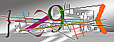

# Captcha

[](https://travis-ci.org/zablose/captcha)

## Installation

```
composer require zablose/captcha
```

## Usage with Laravel

Check that new route is working, by visiting '://localhost/captcha/default'

You should see a captcha image like one of these:





Add captcha to your form, like in the code sample below:

> If standard auth is in use, you may add code sample to `./resources/views/auth/login.blade.php`.

```blade
    <div class="form-group">
        <div class="col-md-6 col-md-offset-4">
            <label>
                
            </label>
        </div>
    </div>
    <div class="form-group{{ $errors->has('captcha') ? ' has-error' : '' }}">
        <label class="col-md-4 control-label">Captcha</label>
        <div class="col-md-6">
            <input type="text" class="form-control" name="captcha" autocomplete="off">
            @if ($errors->has('captcha'))
            <span class="help-block">
                <strong>{{ $errors->first('captcha') }}</strong>
            </span>
            @endif
        </div>
    </div>
```

Add validation rule to your controller, like in the code sample below:

> If standard auth in use, overwrite method `validateLogin` in `./app/Http/Controllers/Auth/LoginController.php`.

```php
    /**
     * Validate the user login request.
     *
     * @param Request $request
     */
    protected function validateLogin(Request $request)
    {
        $this->validate($request, [
            $this->username() => 'required',
            'password'        => 'required',
            'captcha'         => 'required|captcha',
        ]);
    }
```

## Basic Usage

In case you are not happy Laravel user, you may still use this package.

To create captcha, add details to the session and output the image. A code may look like:

```php
<?php

require __DIR__ . '/../vendor/autoload.php';

use Zablose\Captcha\Captcha;

$captcha = new Captcha(['invert' => true, 'width' => 220]);

$data = [
    'captcha' => [
            'sensitive' => $captcha->sensitive(),
            'hash'      => $captcha->hash(),
        ]
];

// Add $data to the session.

echo $captcha->png();

```

To check captcha use:

```php
Captcha::check($sensitive, $captcha, $hash);
```

Feel the joy and happiness!

## License

This package is free software distributed under the terms of the MIT license.
