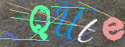
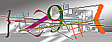

# Captcha

[](https://travis-ci.org/zablose/captcha)

Simple captcha with optional goodies for Laravel.

## Installation

```
composer require zablose/captcha
```

## Usage with Laravel

### New Route & Captcha Types

Check new route is working, by visiting `/captcha` or `/captcha/{type}`.

| Captcha | Type | Dev Link |
| --- | --- | --- |
|  | default | [/captcha/default](https://captcha.zdev:44302/captcha/default) |
|  | small | [/captcha/small](https://captcha.zdev:44302/captcha/small) |
|  | invert | [/captcha/invert](https://captcha.zdev:44302/captcha/invert) |
|  | sharpness | [/captcha/sharpness](https://captcha.zdev:44302/captcha/sharpness) |
|  | blur | [/captcha/blur](https://captcha.zdev:44302/captcha/blur) |
|  | contrast | [/captcha/contrast](https://captcha.zdev:44302/captcha/contrast) |
|  | no-angle | [/captcha/no-angle](https://captcha.zdev:44302/captcha/no-angle) |
|  | bg-color | [/captcha/bg-color](https://captcha.zdev:44302/captcha/bg-color) |

Look at the [config](./config/captcha.php) file for more details.

### Login Form

If standard auth is in use, add captcha to your login form like in
[login.blade.php](./laravel/resources/views/auth/login.blade.php) template.

### Validation

If standard auth is in use, overwrite method `validateLogin` like in
[LoginController](./laravel/app/Http/Controllers/Auth/LoginController.php) class.

## Basic Usage

In case you are not happy Laravel user, you may still use this package.

Create captcha, add details to the session and output the image.

A code may look like:

```php
<?php

require __DIR__ . '/../vendor/autoload.php';

use Zablose\Captcha\Captcha;
use Zablose\Captcha\Config;
use Zablose\Captcha\Image;

$captcha = new Captcha(
    new Image(
        (new Config())->update(['invert' => true, 'width' => 220])
    )
);

$data = [
    'captcha' => [
        'sensitive' => $captcha->isSensitive(),
        'hash' => $captcha->hash(),
    ],
];

// Add $data to the session.

echo $captcha->toPng();
```

To check captcha use:

```php
<?php

    use Zablose\Captcha\Captcha;

    // ...

    Captcha::verify('captcha', 'hash');
```

Feel the joy and happiness!

## Development

> Check submodule [readme](https://github.com/zablose/docker-damp/blob/master/readme.md) for more details about
> development environment used.

### Hosts

Append to `/etc/hosts`.

```
127.0.0.1       captcha.zdev
127.0.0.1       www.captcha.zdev
```

### Quick Start

    $ git clone -b 'dev' --single-branch --depth 1 https://github.com/zablose/captcha.git captcha
    $ cd captcha
    $ git submodule update --init
    
    # Copy env file, then ammend it to your needs.
    $ cp .env.example .env
    
    $ docker-compose -p zdev up -d
    
    # To see post-script logs, while container is starting.
    $ tail -f docker-damp/logs/all.log
    
    # To enter container, using Bash shell.
    $ docker exec -it captcha-damp bash
    
    (captcha-damp)$ phpunit

## License

This package is free software distributed under the terms of the MIT license.
